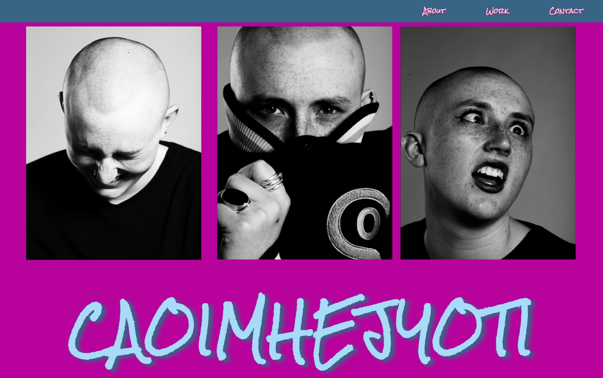
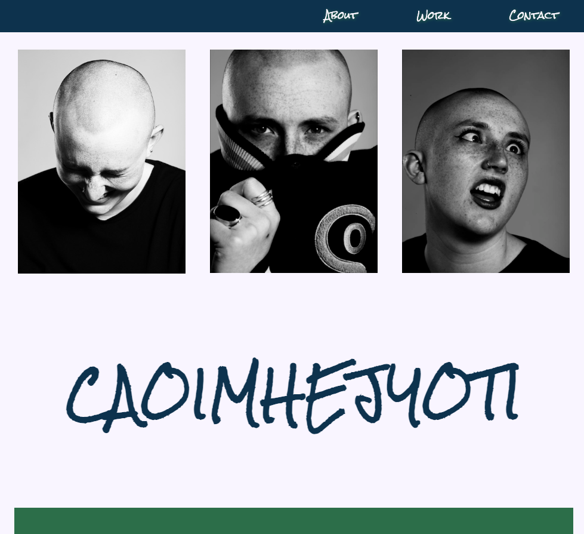

# Module 2 challenge - due 24 November 2022

## User Story and Acceptance Criteria provided for Project

### User Story
AS AN employer
I WANT to view a potential employee's deployed portfolio of work samples
SO THAT I can review samples of their work and assess whether they're a good candidate for an open position

### Acceptance Criteria
GIVEN I need to sample a potential employee's previous work
WHEN I load their portfolio
THEN I am presented with the developer's name, a recent photo or avatar, and links to sections about them, their work, and how to contact them
WHEN I click one of the links in the navigation
THEN the UI scrolls to the corresponding section
WHEN I click on the link to the section about their work
THEN the UI scrolls to a section with titled images of the developer's applications
WHEN I am presented with the developer's first application
THEN that application's image should be larger in size than the others
WHEN I click on the images of the applications
THEN I am taken to that deployed application
WHEN I resize the page or view the site on various screens and devices
THEN I am presented with a responsive layout that adapts to my viewport

## Description
###What was your motivation?
To produce a portfolio to provide to potential employers samples of my work.

### Why did you build this project?
I built this protfolio to develop my skills and continue to  as a platform to ensure that I fully understood the first module of Coding Bootcamp.

### What problem does it solve?
This portfolio has given me a platform to direct potential employers to. They can then see the work that I am able to produce. 

### What did you learn?
This project allowed me to to learn about the following items:

* heros/background images
* responsive design
* linking external fonts
* reasons to have separate css/hmtl files

## Installation
N/A

## Usage

Portfolio to be viewed on browsers. From the site, they can contact me via Contact me links.  

I have started planning for future developments. These can be found within futureplanningstyle.css. This is not currently linked but provides a space to develop ideas.

## Credits
###Sources
Google fonts used in the css file. Please refer to the HTML file for further information. 

### Tutorials
https://www.w3schools.com/cssref/pr_class_position.php https://www.w3schools.com/css/css3_multiple_columns.asp https://css-tricks.com/snippets/css/a-guide-to-flexbox/ https://www.youtube.com/watch?v=xHFzQ8QRjGU&ab_channel=TonyTeachesTech

## License
Please refer to the LICENSE in the repo.